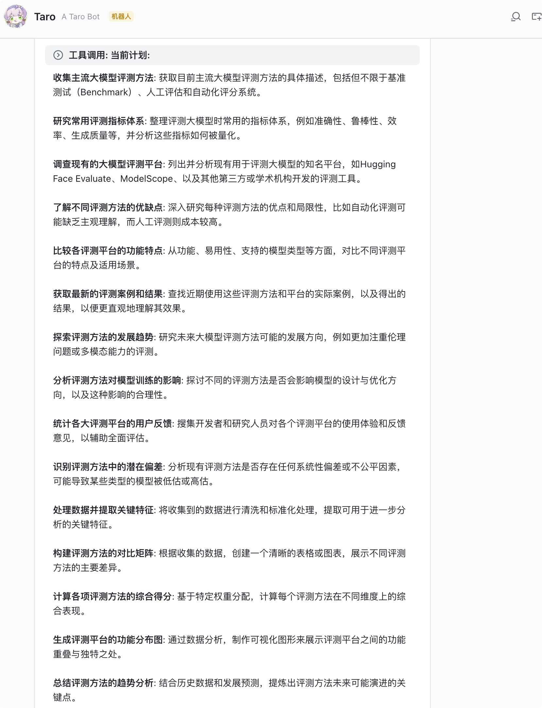
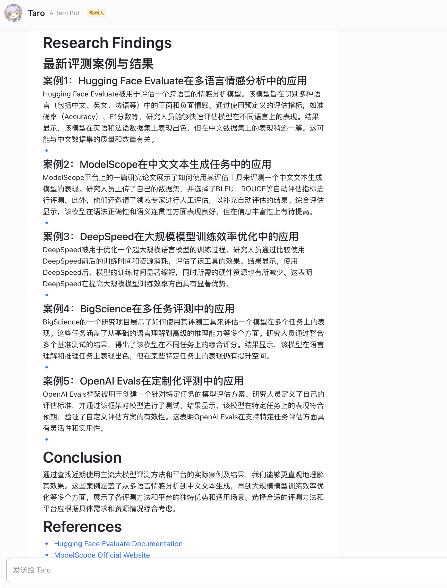
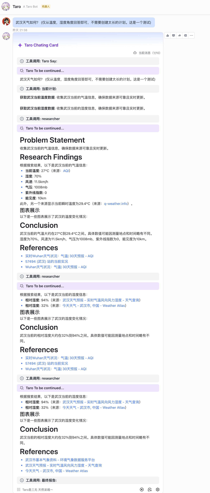

# Taro 🦌 - 飞书智能研究助手

  
  
  
<strong>将 DeepResearch 的强大研究能力无缝集成到飞书生态系统中</strong>

  
  
  
  
  

## ✨ 项目简介

Taro 是一个革命性的智能研究助手，将开源 [DeepResearch](https://github.com/deepresearch/deepresearch) 框架的强大能力深度整合到飞书生态系统中。通过原生的飞书卡片界面和智能工具调用，为团队协作和知识管理提供全新的 AI 驱动体验。

## 🚀 核心特性

### 🎯 飞书深度适配
- **原生卡片界面**: 使用飞书卡片完美适配聊天界面，提供流畅的用户体验
- **智能工具调用**: 对 LLM 工具调用进行深度优化，支持复杂的研究流程
- **无缝集成**: 与飞书生态系统完美融合，无需切换平台

### 📚 知识库智能管理
- **文档自动解析**: 自动读取和分析飞书文档内容
- **Wiki 知识整合**: 将飞书 Wiki 作为参考资料，构建丰富的知识图谱
- **一键 RAG 构建**: 快速构建基于飞书内容的检索增强生成系统

### ⚡ 高性能架构
- **全异步设计**: 完全异步架构，确保高并发和低延迟
- **流式处理**: 支持实时流式响应，提升用户体验
- **高效缓存**: 智能缓存机制，减少重复计算

## 🎪 功能演示

### 1. 开始你的研究之旅

*简单提出你的研究问题，Taro 将为你启动智能分析流程*

### 2. 智能研究计划生成

*AI 自动生成详细的研究计划，包含多个分析角度和执行步骤*

### 3. 深度分析报告

*获得结构化的深度分析报告，包含数据支撑和专业见解*

### 4. 完整工作流程

*从问题提出到最终报告的完整智能化流程*

## 🛠️ 技术栈

- **框架**: LangChain + LangGraph
- **飞书集成**: lark-oapi + EasyLark
- **异步处理**: asyncio + aiosqlite
- **HTTP 客户端**: httpx
- **测试框架**: pytest + pytest-asyncio

## 🎯 适用场景

- **企业研究团队**: 快速进行市场调研和竞品分析
- **学术机构**: 文献综述和研究报告生成
- **产品团队**: 用户需求分析和功能规划
- **咨询公司**: 行业报告和解决方案制定
- **个人研究者**: 深度学习和知识整理

## 🌟 为什么选择 Taro？

### 🔥 原生飞书体验
不同于其他需要切换平台的解决方案，Taro 直接在飞书中提供完整的研究体验，让团队协作更加自然。

### 🧠 智能化程度高
基于 DeepResearch 的先进算法，提供比传统搜索更深入、更准确的分析结果。

### 📈 企业级性能
全异步架构保证了企业级的性能表现，支持大规模团队同时使用。

### 🔒 数据安全
所有数据都在你的飞书环境中处理，确保企业数据的安全性和隐私性。

## 🤝 参与贡献

我们欢迎所有形式的贡献！无论是功能建议、Bug 报告还是代码提交，都能帮助 Taro 变得更好。

## 📄 开源协议

本项目基于开源协议发布，具体请查看 [LICENSE](LICENSE) 文件。

## 🙏 致谢

- 感谢 [DeepResearch](https://github.com/deepresearch/deepresearch) 项目提供的强大研究框架
- 感谢飞书开放平台提供的丰富 API 支持
- 感谢所有为这个项目贡献代码和想法的开发者

---

  
🌟 如果这个项目对你有帮助，请给我们一个 Star！

  
📧 有任何问题或建议，欢迎提交 Issue 或 Pull Request

